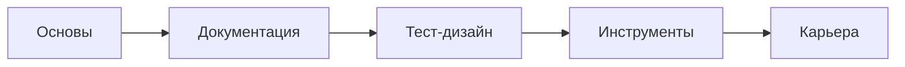

# 📚 Учебный план курса "Ручное тестирование ПО"

## 📅 Общие параметры
- **Длительность урока**: 2 академических часа (90 минут)
- **Занятий в неделю**: 2-3 (в среднем 2.5)
- **Общая продолжительность**: 14 недель / 35 уроков
- **Форматы занятий**:
  - (В) - Вебинар
  - (ПЗ) - Практическое задание
  - (ЛР) - Лабораторная работа
  - (К) - Консультация
  - (Т) - Тест
  - (ПР) - Работа над проектом

## 🗓 Понедельный план

### Неделя 1: Введение в QA
| Урок | Тип | Тема | Задачи |
|------|-----|------|--------|
| 1 | В | Знакомство с профессией QA | Роль тестировщика, мифы и реальность |
| 2 | ЛР | Настройка рабочего окружения | Установка ПО, регистрация в Jira |
| 3 | В | Профессиональная коммуникация | Как задавать вопросы и описывать проблемы |

### Неделя 2: Основы тестирования
| Урок | Тип | Тема |
|------|-----|------|
| 4 | В | SDLC: Waterfall, Agile/Scrum |
| 5 | В | STLC и уровни тестирования |
| 6 | ПЗ | Анализ ТЗ и определение типов тестирования |

### Неделя 3: Типы и принципы
| Урок | Тип | Тема |
|------|-----|------|
| 7 | В | Функциональное и нефункциональное тестирование |
| 8 | В | Тестирование изменений и принципы ISTQB |
| 9 | ПЗ+Т | Практика по типам тестирования |

### Неделя 4: Тест-анализ
| Урок | Тип | Тема |
|------|-----|------|
| 10 | В | Анализ требований |
| 11 | ЛР | Практика работы с требованиями |
| 12 | В | Создание чек-листов |

[... сокращено для примера ...]

### Неделя 14: Завершение
| Урок | Тип | Тема |
|------|-----|------|
| 41 | В | Подготовка к собеседованиям |
| 42 | К | Финальные консультации |
| 43 | В | Защита проектов и вручение сертификатов |

## 📊 Распределение по форматам


## 📊 Структура курса

| Модуль | Уроков | 🔍 Содержание | 🛠 Практика |
|--------|--------|---------------|-------------|
| **Основы тестирования** | 6 | <ul><li>SDLC/STLC</li><li>Типы тестирования</li><li>Принципы ISTQB</li></ul> | Анализ ТЗ, определение типов тестирования |
| **Тест-документация** | 9 | <ul><li>Чек-листы</li><li>Тест-кейсы</li><li>Баг-репорты в Jira</li></ul> | 50+ тест-кейсов, 20+ баг-репортов |
| **Тест-дизайн** | 7 | <ul><li>EP/BVA</li><li>Таблицы решений</li><li>Pairwise</li></ul> | Создание тестовых наборов |
| **Инструменты** | 6 | <ul><li>Chrome DevTools</li><li>SQL-запросы</li><li>Мобильное тестирование</li></ul> | Лабораторные работы с инструментами |
| **Карьера** | 4 | <ul><li>Составление резюме</li><li>Собеседования</li><li>Поиск работы</li></ul> | Мок-собеседования |

## 📌 Key Features



**Фокус программы:**
1. **70% практики** - реальные задания с проверкой
2. **Современные инструменты** - Jira, DevTools, Postman
3. **Подготовка к трудоустройству** - от резюме до собеседований
4. **Гибкий формат** - теория + интерактивные задания

## 🎯 Итоговые навыки
```python
skills = {
    'Теория': ['SDLC', 'ISTQB', 'Тест-дизайн'],
    'Инструменты': ['Jira', 'DevTools', 'SQL'],
    'Документация': ['Тест-кейсы', 'Чек-листы', 'Баг-репорты'],
    'Карьера': ['Резюме', 'Собеседования', 'Поиск работы']
}
```
