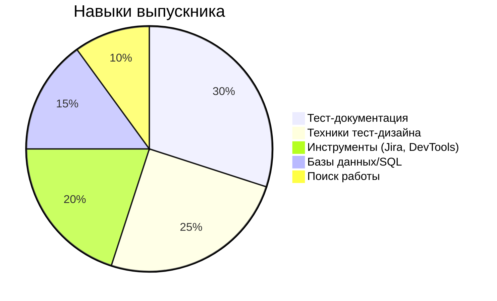
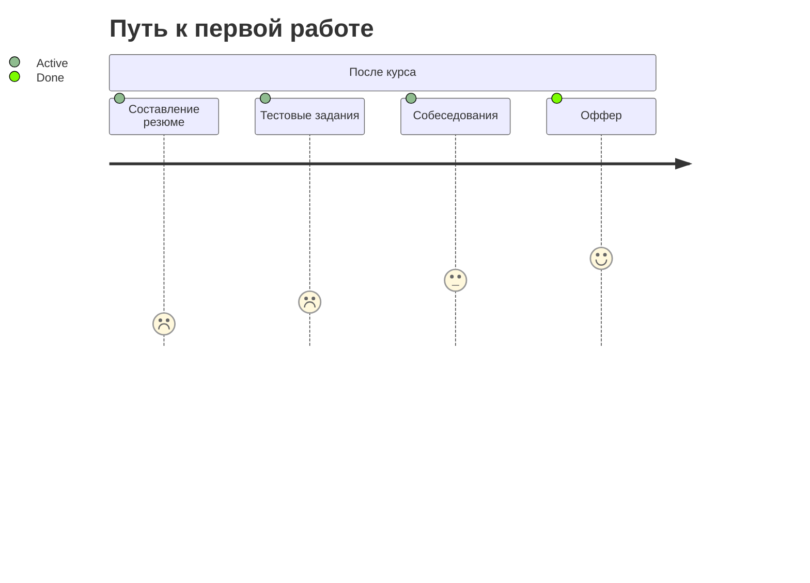

# 🚀 Курс "Manual QA Engineer: от нуля до Junior"

```prompt
Роль: Организатор курса по ручному тестированию ПО
Цель: Подготовка Junior QA Engineer за 3.5 месяца
Формат: 70% практики, 30% теории
Уровень: Для начинающих (требуется только уверенное владение ПК)
```

## 🎯 Основные принципы
- **Постепенное усложнение**  
  От основ тестирования до реальных проектов
- **Практико-ориентированность**  
  Чек-листы, тест-кейсы и баг-репорты на реальных примерах
- **Актуальные инструменты**  
  Jira, DevTools, SQL, мобильные эмуляторы
- **Поддержка**  
  Менторство + чат студентов + разборы заданий

## 🛠 Итоговые навыки


## 📚 Программа курса

### Модуль 0: Введение (1 неделя)
```markdown
1. [x] Знакомство с профессией QA
2. [x] Настройка рабочего окружения
3. [x] Основы профессиональной коммуникации
```

### Модуль 1: Основы тестирования (2 недели)
**Ключевые темы:**
- SDLC/STLC
- Типы и уровни тестирования
- Принципы тестирования (ISTQB)

**Лабораторная:**  
```sql
-- Пример SQL для тестировщика
SELECT bug_id, status FROM bugs 
WHERE priority = 'High' 
ORDER BY created_date DESC;
```

### Модуль 2: Тест-документация (3 недели)
| Артефакт       | Инструменты      | Пример задания |
|----------------|------------------|----------------|
| Чек-листы      | Excel/Google Docs| Проверить форму логина |
| Тест-кейсы     | TestRail/Zephyr  | Написать 10 тест-кейсов |
| Баг-репорты    | Jira             | Завести 5 багов в Jira Cloud |

### Модуль 3: Тест-дизайн (3 недели)
1. Эквивалентное разделение
2. Граничные значения
3. Таблицы решений
4. State Transition
5. Pairwise testing

**Пример:**
```python
# Генератор тестовых данных
boundary_values = [0, 1, 50, 99, 100]  # для диапазона 1-100
```

### Модуль 4: Инструменты (3 недели)
- **Jira:** Рабочие процессы, JQL
- **DevTools:** Network, Console
- **Мобильное тестирование:** Android Studio Emulator
- **SQL:** SELECT, JOIN, WHERE
- **HTTP/HTTPS:** Методы и коды ответов

### Модуль 5: Карьера (2 недели)
```markdown
- [ ] Составление резюме
- [ ] Подготовка к собеседованию
- [ ] Финальный проект
- [ ] Дорожная карта развития
```

## 🛠 Практические задания
1. **Тест-кейсы** для формы регистрации
2. **Баг-репорты** в Jira для тестового приложения
3. **SQL-запросы** для проверки данных
4. **Анализ** HTTP-запросов через DevTools

## 📌 Пример промпта для студентов
```prompt
Напиши 5 тест-кейсов для проверки функционала поиска:
- Поле ввода: макс 100 символов
- Фильтры: по категориям (электроника, книги)
- Сортировка: цена/рейтинг

Формат:
1. ID | Название | Шаги | Ожидаемый результат
```

## 💼 Карьерные результаты
**Портфолио выпускника:**
- 50+ тест-кейсов
- 20+ баг-репортов
- 10+ чек-листов
- 1 итоговый проект

**Трудоустройство:**


## 📅 Расписание (14 недель)
| Неделя | Модуль          | Ключевой навык          |
|--------|-----------------|-------------------------|
| 1      | Введение        | Настройка окружения     |
| 2-3    | Основы          | STLC, типы тестирования |
| 4-6    | Документация    | Jira, тест-кейсы        |
| 7-9    | Тест-дизайн     | Boundary Values         |
| 10-12  | Инструменты     | DevTools, SQL           |
| 13-14  | Карьера         | Собеседования           |

## 📂 Структура репозитория
```
qa-course/
├── modules/          # Материалы по модулям
├── assignments/      # Практические задания
├── examples/         # Образцы документов
└── README.md         # Инструкция
```

## 🚀 Как начать?
1. Клонируйте репозиторий
2. Изучите материалы модулей по порядку
3. Выполняйте задания в папке `assignments`
4. Задавайте вопросы в Issues
